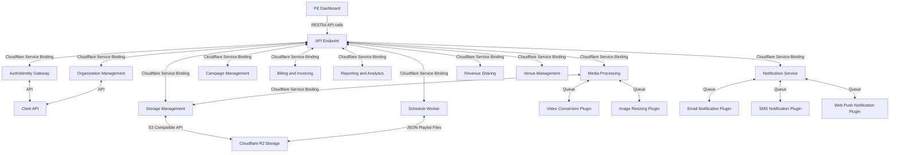

#Architecture overview

## 1. High-Level Architecture

The architecture of the ADSBIN platform is designed to be scalable, modular, and secure. The platform consist out of a Frontend Dashboard Application that talks to an API endpoint. The API endpoint is responsible for handling requests from the frontend, processing data, and interacting with several microservices or modules. The microservices are responsible for specific tasks such as user management, campaign management, billing, and reporting. The platform is hosted on a cloud infrastructure to ensure high availability and reliability.

Every module is designed to be independent and loosely coupled, allowing for easy maintenance, updates, and scaling. The platform follows a client-server model, where the frontend interacts with the backend through RESTful API calls. The API is secured using authentication and authorization mechanisms to ensure data privacy and integrity. The authentication is done through the Clerk API, which provides secure user authentication and management. This works with JWT tokens to ensure secure communication between the frontend and backend.

Modules:

1. **Module**: Frontend Dashboard Application

- **Description**: The user interface for creating and managing ad campaigns, viewing analytics, and monitoring performance. Built with Next.js and React, the dashboard provides an intuitive and user-friendly experience for advertisers and venue owners. Will be deployed on Cloudflare Pages.
- **Level**: Core

2. **Module**: API Endpoint

- **Description**: This will expose several RESTful API endpoints that the frontend can interact with. The API is built with Hono.js on a Cloudflare Worker. The API is responsible for handling requests, processing data, and interacting with other microservices. The microservices communicate with each other through either direct service calls or through Queues. The API is secured using authentication and authorization mechanisms to ensure data privacy and integrity. This endpoint will also expose TypeScript types for the frontend to use.
- **Level**: Core

3. **Module**: Auth/Identity Gateway

- **Description**: This module is responsible for managing user authentication, authorization, and user roles. It is built with Clerk API and JWT tokens to ensure secure communication between the frontend and backend. This will query the Clerk API to verify the user's identity and roles.
- **Level**: Core

4. **Module**: Storage Management

- **Description**: This module is responsible for storing and managing media assets, campaign data, and user information. It uses a cloud storage solution like AWS S3 to store images, videos, and other media assets securely. It provides a simple interface for uploading, retrieving, and deleting files.
- **Level**: Core

5. **Module**: Media Asset Processing

- **Description**: This module is responsible for processing media assets, such as resizing images, compressing videos, and generating thumbnails. It uses serverless functions to perform these tasks asynchronously and efficiently. This module is built with Cloudflare Workers to make media conversion jobs.
- **Level**: Core

- **Module**: Video Conversion Plugin

  - **Description**: This will be the Coconut.io API. This API will be used to convert videos to the correct format and size. This will be done through a Cloudflare Worker, which will pick up the conversion job from the Pub/Sub and send the video to the Coconut.io API. When the video is converted, the Cloudflare Worker will pick up the video and store it in the correct location.
  - **Level**: Aux

- **Module**: Image Resizing Plugin
  - **Description**: This will be a Cloudflare Worker that will resize images to the correct size. This will be done through a Cloudflare Worker, which will pick up the conversion job from a Queue and resize the image. When the image is resized, the Cloudflare Worker will pick up the image and store it in the correct location.
  - **Level**: Aux

6. **Module**: Campaign Management

- **Description**: This module is responsible for creating, updating, and scheduling ad campaigns. It provides an interface for advertisers to set campaign details, target locations, and demographics. It uses a KV store to store campaign data and metadata. This module is built with Cloudflare Workers and Durable Objects to ensure high availability and scalability.
- **Level**: Core

7. **Module**: Billing and Invoicing

- **Description**: This module is responsible for managing billing cycles, invoices, and payment processing. It integrates with payment gateways like Stripe to handle transactions securely. It generates invoices based on campaign performance and billing cycles. This module is built with Cloudflare Workers and Durable Objects to ensure real-time billing and invoicing.
- **Level**: Core

8. **Module**: Reporting and Analytics

- **Description**: This module is responsible for generating reports on campaign performance, audience demographics, and engagement metrics. It uses Workers Analytics Engine to process data and generate insights.
- **Level**: Core

9. **Module**: Notification Service

- **Description**: This module is responsible for sending notifications and alerts to users. It integrates with email and SMS services to notify users of campaign approvals, performance milestones, and system updates. This module is built with Cloudflare Workers and Durable Objects to ensure real-time notifications and alerts. It generates Notification Jobs that will be picked up by the different Notification Delivery Plugins.
- **Level**: Core

- **Module**: Email Notification Plugin

  - **Description**: This will be a Cloudflare Worker that will send emails to users. This will be done through a Cloudflare Worker, which will pick up the Notification Job from the Pub/Sub and send the email. When the email is sent, the Cloudflare Worker will pick up the next Notification Job. It will use the Resend API.
  - **Level**: Aux

- **Module**: SMS Notification Plugin

  - **Description**: This will be a Cloudflare Worker that will send SMS to users. This will be done through a Cloudflare Worker, which will pick up the Notification Job from a Notification Queue and send the SMS. When the SMS is sent, the Cloudflare Worker will pick up the next Notification Job. It will use the Twilio API.
  - **Level**: Aux

- **Module**: Web Push Notification Plugin
  - **Description**: This will be a Cloudflare Worker that will send Web Push Notifications to users. This will be done through a Cloudflare Worker, which will pick up the Notification Job from a Queue and send the Web Push Notification. When the Web Push Notification is sent, the Cloudflare Worker will pick up the next Notification Job. It will use the Web Push API.
  - **Level**: Aux

10. **Module**: User/Organization Management

- **Description**: This module is responsible for managing user accounts, roles, and permissions. It interfaces with the Auth/Identity Management module to verify user identities and roles. It provides an interface for administrators to create, update, and delete user accounts. This module is built with Cloudflare Workers and Durable Objects to ensure secure user management. It uses the Clerk API to get and store user information.
- **Level**: Core

11. **Module**: Revenue Sharing

- **Description**: This module is responsible for implementing a profit-sharing model with venue owners. It calculates revenue shares based on campaign performance and billing cycles. It generates reports on revenue sharing and payouts. This module is built with Cloudflare Workers and Durable Objects to ensure real-time revenue sharing and payouts. It also allows super-administrators to set the revenue sharing model.
- **Level**: Core

12. **Module**: Venue Management

- **Description**: This module is responsible for managing venue information, locations, and display units. It provides an interface for venue owners to add, update, and delete venue details. It uses a KV store to store venue data and metadata. This module is built with Cloudflare Workers.
- **Level**: Core

13. **Module**: Schedule Worker

- **Description**: This module is responsible for scheduling jobs and tasks. It writes JSON objects to the R2 Storage that will be fetched by the display units. This module is built with Cloudflare Workers.
- **Level**: Core

## 2. Technology Stack

The ADSBIN platform leverages a variety of technologies and tools to deliver a robust and scalable solution. The technology stack includes:

| **Component**        | **Technologies**                                     |
| -------------------- | ---------------------------------------------------- |
| **Frontend**         | Next.js, React, Tailwind CSS                         |
| **Backend**          | Cloudflare Workers, Hono.js                          |
| **Authentication**   | Clerk API, JWT Tokens                                |
| **Storage**          | Cloudflare R2 Storage, AWS S3                        |
| **Media Processing** | Cloudflare Workers, Coconut.io API                   |
| **Billing**          | Stripe API                                           |
| **Reporting**        | Workers Analytics Engine                             |
| **Notification**     | Cloudflare Workers, Twilio API, Web Push API, Resend |
| **User Management**  | Cloudflare Workers, Clerk API                        |
| **Revenue Sharing**  | Cloudflare Workers, Stripe Connect API               |
